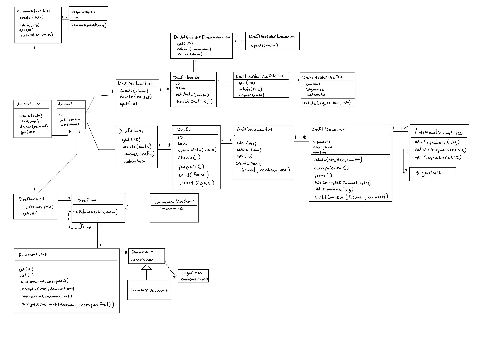

# Client concepts

## Domain model



## Api styles

Proposed 2 api styles:
1. mixing service functions and contexts,
1. context oriented

### 1. Chaining contexts hierarchy with service functions 

*More examples in [code](./../Kontur.Extern.Api.Client/Concept/UsageSamples.cs)*

Contexts have lazy evaluation semantic. Similar to Linq and active recors.

```c#

IExternContext externContext = ...;
var accountContext = externCtx.Accounts.WithId(accId);
await accountContext.Organizations.WithId(orgId).DeleteAsync();
await accountContext.Organizations.List().AllAsync();

```

Pros:
- chaining syntax, easy to discover hierarchy and service functions,
- ability to save to a variable any hierarchy path

Cons:
- additional memory overhead, witch hard to compensate,
- could be hard to change hierarchy paths,
- could be hard to extend,
- could be too verbose.

### 2. Separated context hierarchy from service functions

```c#

var accountCtx = ExternContext
    .WithAccount(accId); // IAccountContext

var orgCtx = accountCtx
    .WithOrganization(orgId); // IOrganizationContext

IExtern extern = ...;
await extern.For(orgCtx).DeleteAsync();

await extern.For(accountCtx).Organizations.List().AllAsync();
// or
var orgsCtx = accountContext.Organizations; // IOrganizationsContext
await extern.For(orgsCtx).List().AllAsync();

```

**TODO -- more examples**

Pros:
- easier to add new dimension of service functions,
- easier to reduce allocations (by returning same object for context and for service paths),
- ability to use structs as contexts,
- passing context to methods looks naturall.

Cons:
- looks stranger and less compact, 
- could be less systematic.

## Pagination

All methods witch implement pagination with `Skip`/`Take` should return `IEntirylist<>` interface. This interface allows to be used:
- to build paginated lists (pages list, load concrete page, etc.),
- to load all data by performing skip/take requests under the hood (`IAsyncEnumerable` or `Task<List<>>`)
- to load top elements (first page)
- to support `Skip`, `Take` semantics

## Deferred tasks

The interface `IDeferred`/`IDeferred<T>` is used to represent background long operations. It allows:
- waiting background operation for completion,
- manually check status for an initiated task,
- track progress during task execution by implementing `IObservable<ProgressStatus>` -- it's only opportunity, it's not planned from start.

To initiate deferred tasks/processes a context interface should declare a property of type `IDeferredOperation`/`IDeferredOperation<TResult>`. This interface allows to initate background operation and returns `IDeferred` instantce to obseve progress. Also, this interface allows manually observe progress or restore `IDeferred` instance.

## Errors handling

In case a request sent to backend and handled by it successfully, but the backend return a particular handling error, the ApiException will be thrown.

## Open questions

1. using `IAsyncEnumerable` in `IPagination<T>`
1. using nullable and non-nullable reference type for methods of the client
1. using latest C# lang version
1. widely using ValueTask's to reduce memory allocations 
1. using value types for primitive types like Inn, Kpp to validate, parse them on them on the client side
1. replace DTO with independent modes (to hide DTO details and isolate models from details and changes of the server-client communication changes)
    - also allow to solve some models naming inconsistency -- with Dto suffix (like CertificateDto) and without suffix (like Warrant, Account)
1. separate client package (assembly) from low level client package (assembly)